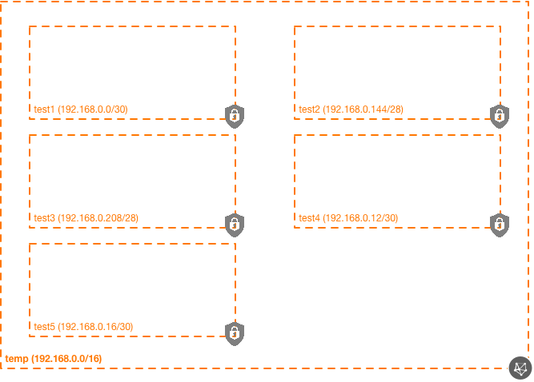

# OCI Subnet Module Example (Simple, Dynamic CIDRs)

## Introduction

| Complexity | CIDRs |
|---|---|
| Simple | Dynamic |

This example shows how to utilize the subnets module in a very simplistic way, generating several subnets that use dynamically-generated CIDRs.

Notes on the subnets in this example:
* test1 uses the first /30 network in the VCN CIDR.
* test2 relies on the default subnet length (/28), allocated from the 192.168.0.128/25 CIDR (and since it doesn't specify the network number, would allocate the second CIDR, because the relative index value of test2 in the map is 1.
* test3 allocates the fifth (cidr\_num of 4 given) /28 network in the 192.168.0.128/25 CIDR.
* test4 uses a static CIDR of 192.168.0.12/30.
* test5 also uses a static CIDR of 192.168.0.16/30.

While dynamic CIDRs are very powerful, their use results in increased complexity.  The following considerations should be kept in mind when using dynamic CIDRs:

* Documentation of the environment can be laborious.  For instance, to create the topology diagram below, manual IPv4 subnet calculations had to be made as the actual CIDR is not given in the code.
* Many organizations are very precise about IP address space allocations (managed by a DDI/IPAM system), which removes many of the benefits of dynamic address allocation (two differing ways of managing IP address space, which cannot easily co-exist).

The following resources are created in this example:

* 1x VCN
* 5x Subnets

## Topology Diagram
This example is intended to the following OCI topology:



## Using this example
Prepare one variable file named `terraform.tfvars` with the required information. The contents of `terraform.tfvars` should look something like the following (or copy and re-use the contents of `terraform.tfvars.template`:

```
tenancy_ocid = "ocid1.tenancy.oc1..xxxxxxxxxxxxxxxxxxxxxxxxxxxxxxxxxxxxxxxxxxxxxxxxxxxxxxxxxxxx"
user_ocid = "ocid1.user.oc1..xxxxxxxxxxxxxxxxxxxxxxxxxxxxxxxxxxxxxxxxxxxxxxxxxxxxxxxxxxxx"
fingerprint= "xx:xx:xx:xx:xx:xx:xx:xx:xx:xx:xx:xx:xx:xx:xx:xx"
private_key_path = "~/.oci/oci_api_key.pem"
region = "us-phoenix-1"
compartment_ocid = "ocid1.compartment.oc1..xxxxxxxxxxxxxxxxxxxxxxxxxxxxxxxxxxxxxxxxxxxxxxxxxxxxxxxxxxxx"
```

Then apply the example using the following commands:

```
$ terraform init
$ terraform plan
$ terraform apply
```
